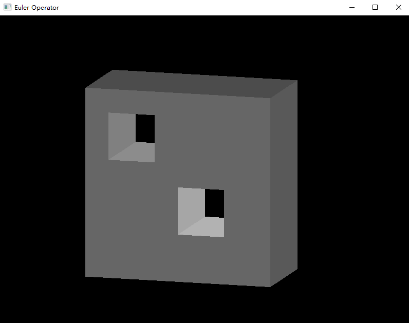

# EulerOperator_homework

## 运行环境

|    | 版本   |
| ------ | ------ |
| Python | 3.8.8 |
| PyOpenGL | 4.1.6 |

需要注意 PyOpenGL 对安装包版本要求较为严格，可能需要版本完全匹配才可正常运行。若不清楚该下载哪个版本，可以先 `pip debug --verbose` 查看与当前 python 版本兼容的 TAG，再到[这里](https://www.lfd.uci.edu/~gohlke/pythonlibs/#pyopengl)选择对应 TAG 的包下载。环境配好后直接运行 `main.py` 文件即可。

## 程序说明

程序图示如下：

程序默认生成带有两个环的正方形，再由扫掠操作生成带有两个孔的长方体。在程序界面中提供了鼠标滚轮缩放，以及左键拖动视角等基本功能，供验证结果准确性。
